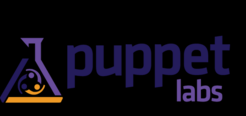

# Azure Dev Ops

----------

## Objectives

At the end of this lab you will know

	1) The fundamental benefits of good DevOps practices
	2) How Azure integrates to 1st and 3rd Party DevOps solutions
	3) Our main competitors and their strengths and weaknesses

## Introduction

Devops is a term that is almost as abstract as 'The Cloud'. It can mean a variety of things and is sort of a clash between Software Development and IT Operations.

In short though DevOps can be defined as the operations needed to deliver high quality software to your customers as fast as possible. This can be operations such as server management, continuous build integration, test automation as well as telemetry systems to gain product insights.

## The Azure Cross Platform Command Line (CLI) Interface

Azure offers two CLI's, one based on powershell with a variety of cmdlets. The other is a cross platform CLI and is based on Node.js. This lab will focus on the Node.js toolset since it will work in all environments


The first thing you want to do before you use the Azure x-platform interface is to [install node.js](http://nodejs.org/).

### Lab 1: Managing Virtual Machines

### Setting up the X-plat CLI

To get things going you will need to install the Azure CLI using npm. Execute the following command in a command line window:

```batch
npm install azure-cli -g
```

The '-g' means to install the module globally so that you can use the Azure CLI from anywhere on the machine. 

Most commands in the CLI require your azure subscription. In order for the tools to have access to your subscription you can either [use Active Directory authentication](http://azure.microsoft.com/en-us/documentation/articles/xplat-cli/#configure) (when you log into Azure you are using Azure Active Directory) or your can [download a publish settings file](https://windows.azure.com/download/publishprofile.aspx). The latter is easier for automation as authentication will work as long as the certificate and subscription is valid.

First [download your publish settings file](https://windows.azure.com/download/publishprofile.aspx). You can click on the link or execute the command which will open your default browser:

```batch
azure account download
```

Now, import your account settings you just downloaded:

```batch
azure account import [path to .publishsettings file]
```

You should get output similar to the following:


Executing the main azure command will get you help output and give you an idea of all the things you can do with the toolset:

```batch
azure
```


Entering the particular command will also bring up the usage for that area of the command line tools. Virtual Machines are particularly useful for DevOps scenarios and can easily be done through the x-plat CLI. The CLI makes it very easy to automate routine tasks with Virtual Machines using scripts. 

Lets create a new Virtual Machine. We will create an Ubuntu VM, in order to do so we need to find a VM image. We can fetch a list of available Virtual Machines by executing the command:

```batch
azure vm image list 
```

We will get back a big list of public VM images available from Azure. We should select a recent Ubuntu build:


In order to create a VM we need a datacenter location for the VM to live. To get a list of valid locations we can place our VM, execute this command:

```batch
azure vm location list
```

We can use this location as input to the **vm create** command to create a new VM:

```batch
azure vm create <yourdomainname> <imagename> <username> <password> --location '<selected datacenter region>'
```


Using a the command line scripting tools available on the platform (usually Batch, Powershell or Bash) we can automate this process in whichever way is needed for your customized DevOps solution. For example, parsing the output of **vm location list** and feeding it into **vm create** can allow you to dynamically select the location of your VM. 

## Infrastructure Automation Tools: Puppet




Puppet is a popular infrastructure automation framework which allows you to manage the configuration of your Virtual Machines and the virtual networks they are attached to among other things. Puppet is sold using a Software-as-a-Service model. Puppet is primarily geared toward Linux operating systems.

Most importantly Azure can be integrated to Puppet management environments using the [Azure plugin for Puppet](http://blogs.msdn.com/b/interoperability/archive/2013/12/12/windows-azure-provisioning-of-linux-and-windows-via-puppet.aspx). The plugin provides the automation access to:

- Virtual Machines
- Virtual Networks
- SQL Servers

## Infrastructure Automation Tools: Chef


Similar to Puppet, Chef is another popular framework that automates IT operations and allows for powerful scripting. Its mostly geared toward Unix/Linux system administration however they are expanding to Windows Servers. Chef is sold using a Software-as-a-Service model

What is important to know is that Chef can run on Azure and integrate to Azure using Knife, a Chef plugin which allows for the manipulation of the following Azure Services:

- Virtual Machines
- Virtual Networks
- SQL Servers


You can read more about the partnership between Chef and Microsoft **[here](http://www.getchef.com/partners/microsoft/)**.

**[This training lab](http://learn.getchef.com/rhel/get-a-virtual-machine/)** will walk you through the basics of creating Chef recipes, which are automation files for server configuration.


## First Party Services: Visual Studio Online


### Overview

Visual Studio Online offers the following services:


- Load Testing Services
- Continuous Deployment
- Project Management tools (SCRUM and other models)
- Telemetry via App Insights

### Lab4: Load Testing Web Applications using Visual Studio Online


Click [here]("Load Testing in VSO/Load Testing.md") to open the lab on Load Testing in Visual Studio Online.